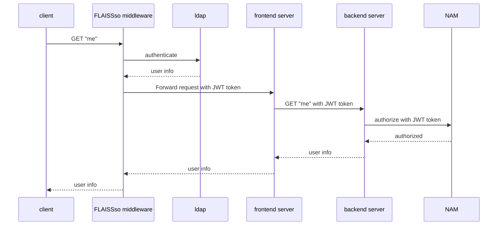

## Development

Run the dev server:

```shellscript
npm run dev
```

### Developing locally with SSO
This will make sure the app is using the auth FLAISSso middleware from alpha environment.
Using this method, the FLAISSso middleware will append a JWT token when doing server-side requests.


Create an env file `sso-middleware.env` with same content as `fint-admin-portal-sso` secret in alpha env.
You can find this as a kubernetes secret by using Lens or k9s. To avoid confusion, it is _not_ the same
as `fint-admin-portal` entry in 1password.


How to run:

1) Start the app:
   ```bash
   npm run dev
   ```

2) Start auth proxy (Caddy + sso-FLAISSso middleware):
   ```bash
   docker compose up
   ```

3) Open:
   http://localhost:8000

Port 8000 points to Caddy, which will work as a proxy and forward requests to the app.

## How authentication works for the frontend
This shows the request flow of how authentication works.


## Deployment

First, build your app for production:

```sh
npm run build
```

Then run the app in production mode:

```sh
npm start
```

Now you'll need to pick a host to deploy it to.

### DIY


Make sure to deploy the output of `npm run build`

-   `build/server`
-   `build/client`

## Styling

This template comes with [Tailwind CSS](https://tailwindcss.com/) already configured for a simple default starting experience. You can use whatever css framework you prefer. See the [Vite docs on css](https://vitejs.dev/guide/features.html#css) for more information.
